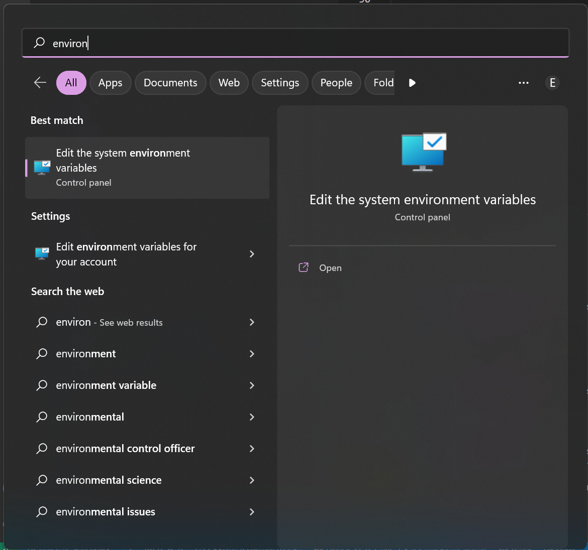

# C++ Setup (windows)

This page describes the recommended setup to build shards on windows and that should provide the fastest iteration times

## Required software

- [LLVM + Clang 15.0.6](https://github.com/llvm/llvm-project/releases/tag/llvmorg-15.0.6) (choose the installer: "LLVM-xx.x.xx-win64.exe")
- Windows SDK (Either [Standalone](https://developer.microsoft.com/en-us/windows/downloads/windows-sdk/) or as part of [Visual Studio](https://developer.microsoft.com/en-us/windows/downloads/)) 

??? LLVM Version
    Newer versions should also work but the version linked here is confirmed to work

## Installing LLVM + Clang

Run the LLVM installer and follow the steps, adding the compiler to your PATH is optional.

## Setting up environment variables

Several environment variables are required so that some rust tools (bindgen) can find the correct compiler.

Open the environment settings from the start menu



Open the `Environment Variables` by pressing the button at the bottom.

Now under `System variables` add the following entries, or edit them if they already exist in the list:

`CLANG_PATH`: Set this to the path of the installed clang compiler from the previous step, for example: `C:\Program Files\LLVM\bin\clang.exe`
`LIBCLANG_PATH`: Set this to the path of the installed LLVM tools, for example: `C:\Program Files\LLVM\bin`

## Telling CMake about the compiler

### Using the command line

During configuration of the project, specify the clang as a compiler using `cmake -DCMAKE_C_COMPILER=<path to clang.exe> -DCMAKE_C_COMPILER=<path to clang++.exe>`

### Using the vscode CMake Tools extension

Using [this](https://marketplace.visualstudio.com/items?itemName=ms-vscode.cmake-tools) extension for vscode, you can tell it which compiler to use by editing the toolchains file.

Inside vscode, open the command menu (CTRL+SHIFT+P) and run the command `CMake: Edit User-Local CMake Kits`, this will open the kits json file.

Inside this file, add an entry for the newly installed compiler, it should look something like this.
You can leave the existing entries or remove them if you don't use them.

```json
[
  {
    "name": "clang-15.0.6-x86_64-pc-windows-msvc",
    "compilers": {
      "C": "C:\\Program Files\\LLVM\\bin\\clang.exe",
      "CXX": "C:\\Program Files\\LLVM\\bin\\clang++.exe"
    }
  }
]
```

Save the file, you should now be able to use the compiler by running the command `CMake: Select a Kit` or from the dropdown in the status bar. Select the newly added kit, using the same name you put in the kits configuration file.

--8<-- "includes/license.md"
